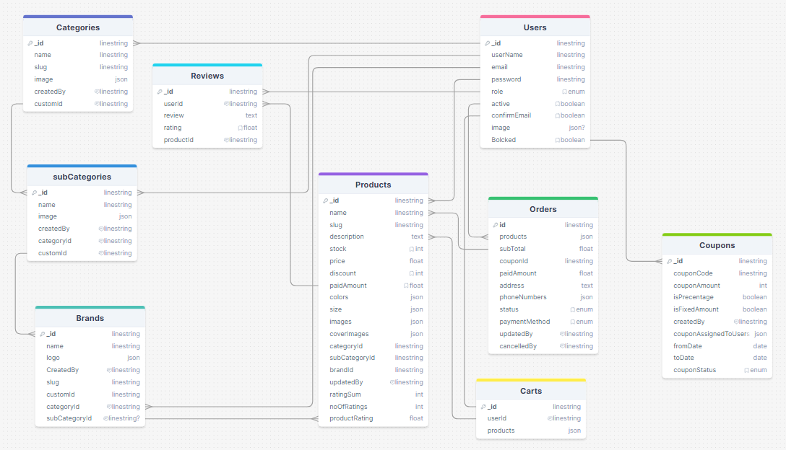

# ClickCart Backend

Welcome to ClickCart Backend! ClickCart is an online marketplace where companies and individuals can sell a variety of products. The ClickCart Backend serves as the foundation for the platform's functionality, handling user authentication, product management, transaction processing, and more.

## Features

- **User Authentication**: Secure user authentication system to protect user accounts and data.
- **Product Management**: CRUD operations for managing products, categories, and sellers.
- **Order Processing**: Handling orders, transactions, and payments securely.
- **Search Functionality**: Implementing search functionality to allow users to find products efficiently.
- **RESTful API**: Providing a RESTful API for seamless integration with the frontend application.
- **Scalability**: Designed for scalability to handle large volumes of users and transactions.

## Getting Started

To get started with ClickCart Backend, follow these steps:

1. **Clone the Repository**: Clone this repository to your local machine using `git clone https://github.com/your-27medMo7sen/clickcart-backend.git`.
2. **Install Dependencies**: Install the necessary dependencies by running `npm install`.
3. **Set Up Environment Variables**: Set up your environment variables, including database connection details, API keys, etc.
4. **Database Setup**: Set up your database and run any necessary migrations or seed data.
5. **Start the Server**: Start the ClickCart Backend server locally by running `run start`.
6. **Test Endpoints**: Test the API endpoints using tools like Postman ,curl or thunder client.
7. **Access online**: You can also access an online sever from that [Link](clickcart-3290.onrender.com)

## Contributing

We welcome contributions from the community! If you'd like to contribute to ClickCart Backend, please follow these guidelines:

- Fork the repository and create your branch from `main`.
- Make your changes and ensure the codebase passes all tests.
- Submit a pull request detailing the changes you've made.

## Database diagram

for a closer look you can reach the [online version](https://drawsql.app/teams/ahmeds-team-32/diagrams/clickcart)

## Feedback

Have any feedback or suggestions for ClickCart Backend? We'd love to hear from you! Feel free to [open an issue](https://github.com/issues) on GitHub or reach out to us directly at [my Email](mailto:am6945@fayoum.edu.eg).
